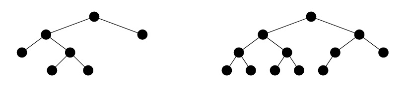

- [两种特殊二叉树](#两种特殊二叉树)
- [二叉树定理](#二叉树定理)
- [前中后序遍历](#前中后序遍历)
  - [递归版](#递归版)
  - [迭代版](#迭代版)
- @TODO 并没有对算法进行测试

# 两种特殊二叉树

- **满二叉树**（下图左）：除叶子节点外的所有分支节点都含有2个非空子节点的二叉树
- **完全二叉树**（下图右）：除了最后一层，其余层都是“满”的，这样的二叉树是完全二叉树




# 二叉树定理

### 1）任意二叉树度数为2节点的个数等于叶节点个数减1

当只有1个节点时，度为0。每派生出1度，就会多出1个节点。派生出的度和派生出的节点数一定相等。那么就得出了总度数和节点总数的关系：

`节点总数 = 总度数 + 1`

设度数为2的节点数为`X2`，度数为1的节点数为`X1`，度数为0的节点数为`X0`。可以得出如下关系式：

`X2 + X1 + X0 = 2X2 + X1 + 1`，推出 `X2 = X0 - 1`

因此，**度数为2的节点个数等于叶节点数减1**

### 2）满二叉树定理：非空满二叉树的叶节点数等于其分支节点数加1

如果已知前一个结论，那么这个定理显然成立。下面分析如果不知道前一个结论，怎么证明

对于只有1个节点的树，该定理成立。从这开始思考，每产生1个分支节点(度数为2)。叶子节点数也会加1。因为要产生一个分支节点，那么这个新的分支节点必然是原来的叶子节点，而新的分支节点又生成了2个新的叶子节点。因此叶子节点的总数先是减1然后加2，因此总数加1。因此，产生n个分支节点时，也产生了n个叶子节点，由于最初只有1个叶子节点，所以该定理成立

### 3）一颗非空二叉树空子树的数目等于其节点数目加1

考虑只有1个根节点的二叉树：它有2个空子树，1个节点，因此结论成立。从这里开始考虑，每产生1个节点。空子树便会先减1然后加2。就和上面结论中每多出1个分支节点，叶子节点的变化一样。因此在原来结论的基础上，由于空子树和节点等量增长。所以结论成立


# 前中后序遍历

- **前序**遍历：根->左->右
- **中序**遍历：左->根->右
- **后序**遍历：左->右->根

假设树节点的定义如下：

```c++
struct TreeNode {
	int val;
	TreeNode* left;
	TreeNode* right;
	
	TreeNode(int v) : val(v), left(nullptr), right(nullptr) {}
};

#define doSomething	//操作当前节点，例如 std::cout << node->val << std::endl;
```

## 递归版

```c++
//前序遍历
inline void preorderTraversalRecursion(TreeNode* node)
{
	if (!node)
	{
		return;									//如果到了叶子节点则停止
	}
	doSomething;								//操作节点内容
	preorderTraversalRecursion(node->left);		//先遍历左节点
	preorderTraversalRecursion(node->right);	//再遍历右节点
}

//中序遍历
inline void inorderTraversalRecursion(TreeNode* node)
{
	if (!node)
	{
		return;
	}
	inorderTraversalRecursion(node->left);		//先遍历左节点
	doSomething;								//操作节点内容
	inorderTraversalRecursion(node->right);		//再遍历右节点
}

//后序遍历
inline void postorderTraversalRecursion(TreeNode* node)
{
	if (!node)
	{
		return;
	}
	postorderTraversalRecursion(node->left);	 //先遍历左节点
	postorderTraversalRecursion(node->right);	 //再遍历右节点
	doSomething;								 //操作节点内容
}
```

## 迭代版

需要使用一个栈作为辅助空间

```c++
#include <stack>
using std::stack;

//前序遍历
inline void preorderTraversalIteration(TreeNode* root)
{
    stack<TreeNode*> st;
    if (root)
    {
	    st.push(root);//如果不是空节点,压入栈中
    }
        

    while (!st.empty()) 
    {
        TreeNode* node = st.top();          //拿到栈顶结点
        st.pop();                           //去除栈顶结点

        doSomething;                        //操作节点内容

        if (node->right)
        {
	        st.push(node->right);           //先压入右节点
        }
            
        if (node->left)
        {
	        st.push(node->left);            //再压入左节点
        }    
    }
}

//中序遍历：
inline void inorderTraversalIteration(TreeNode* root)
{
    stack<TreeNode*> st;

    TreeNode* curr = root;              //获得当前节点

    while (curr || !st.empty())         //如果节点存在或者栈不为空
    {
        if (curr)                       //如果是节点存在
        {
            st.push(curr);              //节点入栈
            curr = curr->left;          //先移动到左节点
        }
        else                            //如果是栈不为空(当前节点为空)
        {
            curr = st.top();            //拿到栈顶结点
            st.pop();                   //去除栈顶结点

            doSomething;                //操作节点内容

            curr = curr->right;         //再移动到右节点
        }
    }
}

//后序遍历
inline void postorderTraversalIteration(TreeNode* root)
{
    stack<TreeNode*> st;
    TreeNode* pre = nullptr;

    if (root)
    {
	    st.push(root);//如果不是空节点,压入栈中
    }
        

    while (!st.empty()) 
    {
        TreeNode* node = st.top();//取出栈顶元素
        /*
         * 出栈条件：
         * 对于叶子节点：直接弹出
         * 对于非叶子节点：如果已经遍历过其左子节点或右子节点，则弹出
         */
        if ((!node->left && !node->right)/* 如果是叶子节点 */ || (pre && (node->left == pre || node->right == pre)/* 如果其左节点或者右节点被遍历过 */)) 
        {
            st.pop();//去除栈顶节点
        	
            doSomething;//操作节点内容
        	
            pre = node;//标识这个节点已经被遍历
        }
        else //如果是一个带孩子的父节点，并且还未访问其左右孩子
        {
            if (node->right)
            {
	            st.push(node->right);//先压入右节点
            }
                
            if (node->left)
            {
	            st.push(node->left);//再压入左节点
            }     
        }
    }
}
```

对于后序遍历，由于其访问序列为：左->右->根。因此还有一种方法，可以按类似前序遍历的方式：根->右->左，然后对得到的结果反序