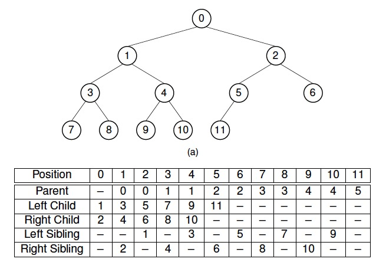

- [插入节点](#插入节点)

- [删除堆顶](#删除堆顶)

- [建堆](#建堆)

- [复杂度](#复杂度)

- @TODO 并没有对算法进行测试

  

堆是一棵完全二叉树，使用数组实现堆，堆分为两种：

- 最大堆：父节点大于任意子节点（因此堆顶为最大值）
- 最小堆：父节点小于任意子节点（因此堆顶为最小值）

对于第i个节点（i从0开始计数）：

- 父节点：`(i-1)/2`
- 左子节点：`2i+1`
- 右子节点：`2i+2`

若包含`sz`个节点，则第一个非叶子节点的序号为`(sz - 2) / 2`



## 插入节点

插入节点时，进行下列操作：

1. 将元素添加到数组末尾；（相当于叶节点接入堆中）
2. 和父节点进行比较，如果大于父节点(以最大堆为例)，则与父节点交换，一直比较交换到根节点

```c++
/********************************************
  * 向堆中插入新元素
  * dest：新元素所在的位置，如果位置超出索引，结果未定义
  * 对堆进行重排(如果指定了root则进行局部堆重排)，如果局部栈顶位置超出索引，结果未定义
  * 如果局部栈顶所在位置大于目标位置，则什么都不做
  ********************************************/
template <typename T>
void push_heap(T arr[], size_t dest, const size_t root = 0)
{
	if(root > dest)
	{
        return;
	}
	
    T val = arr[dest];               //取出目标位置的元素，将当前位置视为空洞
    size_t parent = (dest - 1) / 2;        //计算出父亲节点的位置
	/**
	 * 建最大堆，如果建最小堆换成 arr[parent] > value
	 * 
	 * 除非目标位置`到了指定的根节点`或`父节点比新元素大`
	 * 
	 * 否则:新元素和父节点位置进行交换,再次寻找父节点
	 */
    while (dest > root && arr[parent] < val)
    {
        arr[dest] = arr[parent];
        dest = parent;
        parent = (dest - 1) / 2;
    }
    arr[dest] = val;                 //将元素填入目的地
}
```

## 删除堆顶

删除实际上是将堆顶元素移入数组末尾，并不是真的删除。删除节点时，进行下列操作：

1. 保存数组末尾元素(存如临时变量`v`)，将堆顶元素存入数组末尾
2. 将原来堆顶元素的两个子节点中较大的一个移入堆顶(以最大堆为例)，填补空缺，此时产生新的空缺，继续此步骤，直到空缺为一个叶子节点
3. 将`v`中存储的值移到空缺叶子节点的位置
4. 对上一步中的新叶子节点完成向上比较交换操作

```c++
/********************************************
 * 删除堆顶元素
 * root:指定栈顶，如果指定了则删除局部栈顶，如果局部栈顶位置超出索引，结果未定义
 ********************************************/
template <typename T>
void pop_heap(T arr[], size_t size, const size_t root = 0)
{
    --size;                           //尺寸减少一位，因为栈底存放不需要的栈顶元素
    T val = arr[size];                //取出栈底位置的元素，将当前位置视为空洞
    arr[size] = arr[root];            //将栈顶元素置于栈底
    adjust_heap(arr, size, root, val);
}
```

## 建堆

- **堆的大小固定(且所有元素已知)**：按“序号从大到小”的顺序遍历所有非叶子节点，将这些节点与左右子节点较大者(以最大堆为例)交换，执行siftdown一直到叶子节点，因此，每遍历到一个节点时，其左子树和右子树都已经是最大堆，只需对当前节点执行siftdown操作
- **堆的大小未知(如数据流)**：可以通过插入操作来构建堆

```c++
/********************************************
 * 建堆
 ********************************************/
template <class T>
void make_heap(T arr[], size_t size, size_t root = 0)
{
    size_t parent = (size - 2) / 2;   //寻找第一个非叶子节点
    while (parent >= 0) {   //直到到栈顶 
        T val = arr[parent];
        adjust_heap(arr, size, parent, val);
        --parent;
    }
}
```

## 堆调整

```c++
/**
 * @param arr 调整的目标
 * @param end 指定目标的尾部
 * @param target 目标位置
 * @param val 放置的元素
 */
template<typename T>
void adjust_heap(T arr[], const size_t end, const size_t target, const T& val)
{
    size_t dest = target;                 //从目标开始
    size_t right = 2 * (dest + 1);      //寻找父节点的右子树
    while (right < end)                  //只要这个右子树存在且不是最后一个节点
    {
        if (arr[right] < arr[right - 1])        //如果左子树大于右子树则移动左子树
        {
            --right;
        }
        arr[dest] = arr[right];             //交换父节点和子节点位置
        dest = right;                       //接着对子节点进行移动
        right = 2 * (dest + 1);             //寻找子节点的右子树
    }
    if (right == end)                        //如果右节点刚好到底
    {
        arr[dest] = arr[right - 1];         //将左节点移动到父节点位置
        dest = right - 1;                   //目标位置设为左节点
    }
    arr[dest] = val;                        //将元素放到目标位置上
    push_heap(arr, dest);                   //再对栈进行重排
}
```

## 局部堆大小

```c++
/**
  * @param size 目标容器的size大小
  * @param root 局部栈顶，如果局部栈顶超出索引，结果返回0
  */
inline size_t getPartTreeSize(const size_t size, const size_t root)
{
	if(root >= size)    //索引是0到size-1，所以root必须size
	{
        return 0;
	}
	
    /**
     * 方便计算，从1开始，到size结尾(而不是从0到size-1)
     * 先加上根节点，然后从第二层开始算
     */
    size_t left = root + 1;
    size_t cnt = 1;
    size_t floor_size = 2;                  //第二层开始，满节点数量应该是2个
    while (left *= 2 <= size)                //先 *= 2从第二层开始算，每向下一层位置翻倍(因为是按1开始size结束的)
    {
        if (left + floor_size >= size)       //当前所在层不足或者刚好填满则表示到了最底层
        {
            cnt += size - left + 1;         //将该层的子节点加上(+1是因为按1开始size结束的)
            break;                          //直接退出即可
        }
        cnt += floor_size;                  //不是最底层直接加上当前楼层的节点数量
        floor_size *= 2;                    //每下一层楼层的节点数量翻倍
    }
    return cnt;
}
```

## 复杂度

- **插入节点**：时间复杂度为O(logn)
- **删除堆顶**：时间复杂度为O(logn)
- **建堆**：
  - **堆的大小固定(且所有元素已知)**：每个siftdown操作的最大代价是节点被向下移动到树底的层数。在任意一棵完全二叉树中，大约有一半的节点是叶节点，因此不需要向下移动。四分之一的节点在叶节点的上一层，这样的节点最多只需要移动一层。每向上一层，节点的数目就为前一层的一般，而子树高度加1，因此移动层数加一。**时间复杂度为O(n)**
  - **堆的大小未知(如数据流)**：由于插入节点的时间代价为O(logn)，对于n个元素，每个执行一次插入操作，所以**时间复杂度为O(nlogn)**

